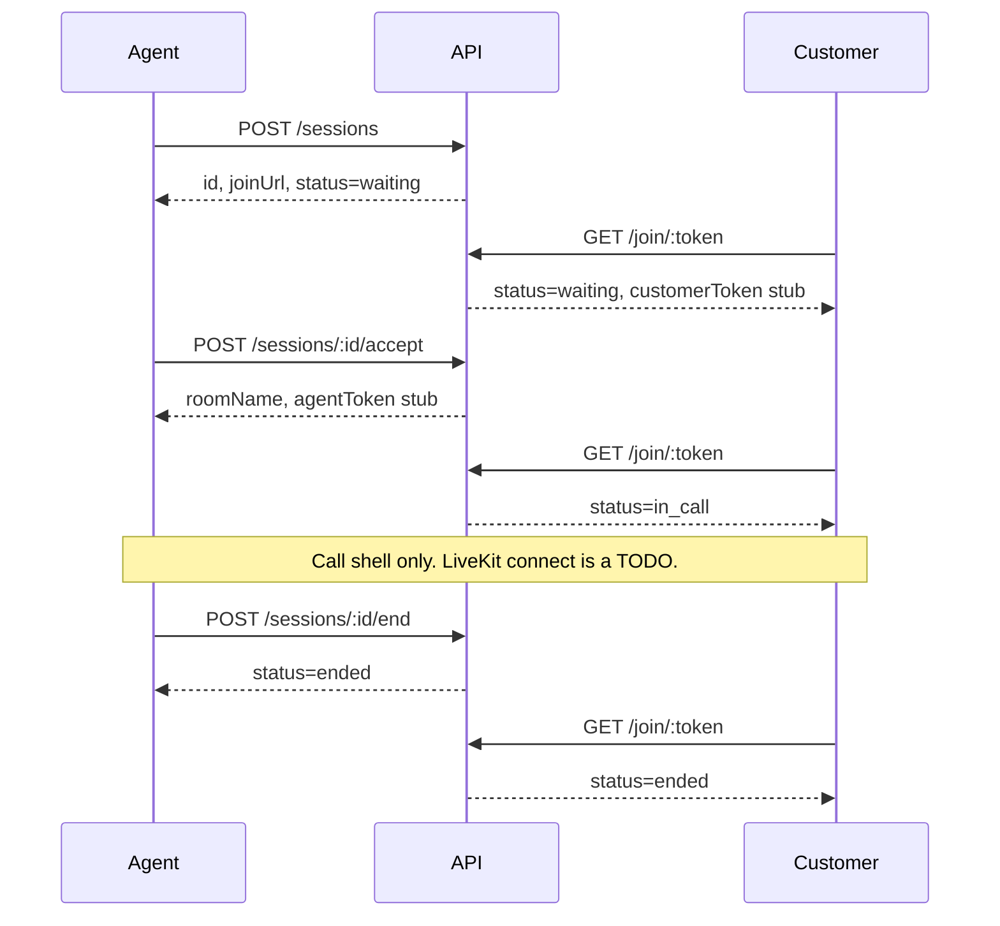

# Superbank Video KYC POC

P0 session shell for a video KYC proof of concept. An agent creates a verification session, the customer opens a join link, the agent accepts from the queue, both sides enter a call shell, and the agent ends the session.

LiveKit room names and participant tokens are placeholders (`lk-stub-…`). Cameras and microphones stay off. OCR, liveness, IDV, AML, SSO, and production hardening are out of scope.

## Two-browser local run

Requires Node.js 20+ and pnpm 10.

```bash
git clone https://github.com/romin991/video-kyc-poc.git
cd video-kyc-poc
corepack enable
corepack prepare pnpm@10.33.3 --activate
pnpm install
pnpm dev
```

`pnpm dev` starts all three processes:

| Process | URL |
| --- | --- |
| API | http://127.0.0.1:3001 |
| Agent dashboard | http://127.0.0.1:5173 |
| Customer webview | http://127.0.0.1:5174 |

1. **Browser A (agent).** Open http://127.0.0.1:5173. The demo name in the header is a display label, not a login.
2. Click **Create session**. Copy the customer join link. It looks like `http://localhost:5174/join/<token>`.
3. **Browser B (customer).** Paste that link. The page should say **Waiting for an agent**. Leave it open.
4. **Browser A.** The session appears in the queue. Click **Accept**.
5. Both windows show the in-call shell: a remote tile and a local tile. Tokens look like `lk-stub-agent-…` and `lk-stub-customer-…`. No camera permission prompt is expected.
6. **Browser A.** Click **End session**.
7. Browser A leaves the call stage. Browser B changes to **Session ended** on its next check (about 1.5s) and stops polling.

Run the processes in separate terminals if you want quieter logs:

```bash
pnpm dev:api
pnpm dev:agent
pnpm dev:customer
```

The API keeps sessions in memory. Restarting it drops the queue and invalidates open join links.

## Signaling

| Method | Path | Result |
| --- | --- | --- |
| `POST` | `/sessions` | `{ id, joinUrl, joinToken, status: "waiting", roomName, createdAt, createdBy }` |
| `GET` | `/sessions?status=waiting` | `{ sessions }` queue |
| `GET` | `/sessions/:id` | one session |
| `POST` | `/sessions/:id/accept` | `{ sessionId, roomName, agentToken, status: "in_call" }` |
| `GET` | `/join/:token` | `{ sessionId, roomName, customerToken, status }` |
| `POST` | `/sessions/:id/end` | `{ status: "ended", sessionId }` |
| `GET` | `/health` | `{ ok: true, service: "vkyc-api" }` |

`agentToken` and `customerToken` are stub strings, not LiveKit JWTs. A second accept returns `409`. Ending is idempotent. `X-Demo-Agent` is stored as `createdBy` and is not checked.

```bash
curl -s -X POST http://127.0.0.1:3001/sessions \
  -H 'content-type: application/json' \
  -H 'x-demo-agent: Desk 1' \
  -d '{}'
```



## LiveKit handoff

Wire media in both hooks (they match on purpose):

- `apps/agent-dashboard/src/livekit.ts`
- `apps/customer-webview/src/livekit.ts`

Mint real tokens in `apps/api/src/tokens.ts` (`stubParticipantToken`). Room names are already `vkyc-<sessionId>`.

Each call shell renders:

- `<video data-livekit="remote">` for the other participant
- `<video data-livekit="local" muted>` for this participant

Those elements stay hidden until `data-active="true"` is set after `track.attach(...)`. Set `VITE_LIVEKIT_URL` (see `.env.example`) when a LiveKit server exists. The hook reads it and still does not connect.

## Layout

```
apps/api                 Express session store and REST
apps/agent-dashboard     Vite + React desk (create, queue, accept, end)
apps/customer-webview    Vite + React join page (waiting, in-call, ended)
```

## Scripts

```bash
pnpm test       # API lifecycle tests
pnpm typecheck  # tsc for all apps
pnpm build      # production bundles for both UIs
```

Optional environment variables are listed in `.env.example`. Defaults match the table above. The API listens on `127.0.0.1` only.

## Out of scope

Real LiveKit rooms, camera capture, OCR, liveness, IDV, AML, SSO, persistence, and production hardening.
