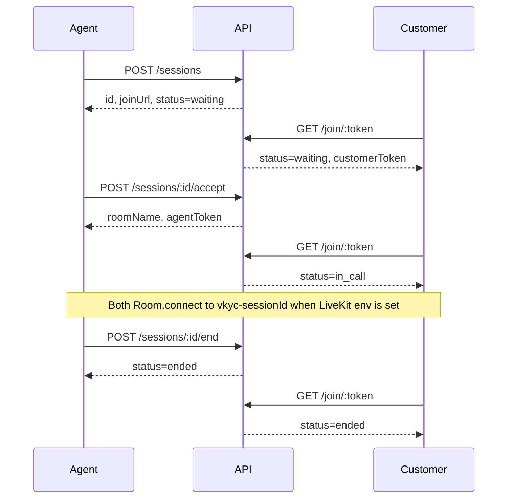

# Superbank Video KYC POC

Video KYC proof of concept. An agent creates a verification session, the customer opens a join link, the agent accepts from the queue, both sides enter a call, and the agent ends the session. Wave 1 adds a stub customer payload, a checklist, still-frame captures, after-call notes, and a disposition (Approve, Reject, or UTV) on that same session.

When LiveKit is configured, both browsers join room `vkyc-<sessionId>` and publish camera and microphone. When it is not, accept and join still succeed with non-connecting `lk-stub-…` tokens and the call shell stays up. OCR, liveness models, IDV, AML, SSO, and production hardening are out of scope. The checklist is a manual checkbox, not a model.

## Two-browser local run

Requires Node.js 20+ and pnpm 10.

```bash
git clone https://github.com/romin991/video-kyc-poc.git
cd video-kyc-poc
corepack enable
corepack prepare pnpm@10.33.3 --activate
pnpm install
pnpm dev
```

`pnpm dev` starts all three processes:

| Process | URL |
| --- | --- |
| API | http://127.0.0.1:3001 |
| Agent dashboard | http://127.0.0.1:5173 |
| Customer webview | http://127.0.0.1:5174 |

1. **Browser A (agent).** Open http://127.0.0.1:5173. The demo name in the header is a display label, not a login.
2. Click **Create session**. Copy the customer join link. It looks like `http://localhost:5174/join/<token>`.
3. **Browser B (customer).** Paste that link. The page should say **Waiting for an agent**. Leave it open.
4. **Browser A.** The session appears in the queue. Click **Accept**.
5. Both windows show the in-call shell: a remote tile and a local tile. With LiveKit env set, allow the camera and microphone. With it unset, the tiles stay on the placeholder and no permission prompt is expected.
6. **Browser A.** The in-call desk shows the stub customer (name, phone, product, application id, reason for VKYC), a checklist, stills, and ACW notes. Toggle a checklist item. It stays checked after refresh.
7. Set **Kind** to **ID**. Within about 1.5s, Browser B shows the customer camera full-frame with a card outline and the line “align ID inside the box”. **Face** or **Other** removes it. **Capture still** grabs one JPEG from the remote customer LiveKit camera when that track is live, and uses the customer tile when the track is not available. It uploads with the kind selected on the desk, including `id`. **Add still** uploads a JPEG or PNG file, which is enough when cameras are off. The thumbnail stays on the desk and in after-call work after refresh.
8. **Browser A.** Click **End session**.
9. Browser A leaves the call stage and opens after-call work for that session. The same stills and notes are there. Approve, Reject, and UTV stay disabled until at least one still exists. Pick one. Refresh the desk: **Open ACW** on the ended row shows the same disposition, notes, and stills.
10. Browser B changes to **Session ended** on its next check (about 1.5s) and stops polling.

Run the processes in separate terminals if you want quieter logs:

```bash
pnpm dev:api
pnpm dev:agent
pnpm dev:customer
```

The API keeps sessions, checklist, notes, disposition, and stills in memory. Restarting it drops them and invalidates open join links.

## LiveKit

Create a free project at [LiveKit Cloud](https://cloud.livekit.io). The free tier is enough for this proof of concept. After the project exists:

1. Copy the project WebSocket URL from the project page. It looks like `wss://your-project.livekit.cloud`.
2. Open **Settings → Keys** and copy the API key and API secret. See [where to find the key and secret](https://community.livekit.io/t/where-to-find-the-livekit-api-key-and-secret/92).
3. Put them in a repo-root `.env`. That file is gitignored. `.env.example` lists the names.

```bash
LIVEKIT_URL=wss://your-project.livekit.cloud
LIVEKIT_API_KEY=your_api_key
LIVEKIT_API_SECRET=your_api_secret
VITE_LIVEKIT_URL=wss://your-project.livekit.cloud
```

`VITE_LIVEKIT_URL` is the same WebSocket URL as `LIVEKIT_URL`. Restart `pnpm dev` after changing `.env`. Vite reads `VITE_*` at startup. The API loads the repo-root `.env` when it starts and does not override variables already set in the environment.

The API mints a LiveKit JWT with `livekit-server-sdk`:

| Claim | Value |
| --- | --- |
| identity | `agent` or `customer` |
| `roomJoin` | true |
| `room` | `vkyc-<sessionId>` |
| `canPublish` | true |
| `canSubscribe` | true |
| TTL | 10 minutes |

The same token is reused for a role and room until it is close to expiry, so the customer's join poll does not reconnect the call. Use headphones if both browsers are on one machine. The local tile stays muted.

If `LIVEKIT_API_KEY` or `LIVEKIT_API_SECRET` is missing, accept and join return `lk-stub-…` and do not throw. If `VITE_LIVEKIT_URL` is missing, the browser skips `Room.connect`. Either way the session shell still creates, accepts, joins, and ends.

## Signaling

| Method | Path | Result |
| --- | --- | --- |
| `POST` | `/sessions` | session, including stub `onboardingPayload` unless the body overrides it |
| `GET` | `/sessions?status=waiting` | `{ sessions }` queue |
| `GET` | `/sessions/:id` | one session, including checklist, notes, disposition, and `captures[]` |
| `PATCH` | `/sessions/:id` | update `checklist`, `acwNotes`, `disposition`, and `captureGuide` |
| `POST` | `/sessions/:id/captures` | store one JPEG or PNG still |
| `GET` | `/sessions/:id/captures/:captureId` | still bytes (`image/jpeg` or `image/png`) |
| `POST` | `/sessions/:id/accept` | `{ sessionId, roomName, agentToken, status: "in_call" }` |
| `GET` | `/join/:token` | `{ sessionId, roomName, customerToken, status, captureGuide }` |
| `POST` | `/sessions/:id/end` | `{ status: "ended", sessionId }` |
| `GET` | `/health` | `{ ok: true, service: "vkyc-api" }` |

`agentToken` and `customerToken` are LiveKit JWTs when the API key and secret are set, and `lk-stub-…` strings otherwise. A second accept returns `409`. Ending is idempotent. `X-Demo-Agent` is stored as `createdBy` and is not checked.

```bash
curl -s -X POST http://127.0.0.1:3001/sessions \
  -H 'content-type: application/json' \
  -H 'x-demo-agent: Desk 1' \
  -d '{}'
```



## Call tiles

Each call shell renders:

- `<video data-livekit="remote">` for the other participant
- `<video data-livekit="local" muted>` for this participant

Those elements stay hidden until `data-active="true"` is set after a video track attaches. The hooks that do this match on purpose:

- `apps/agent-dashboard/src/livekit.ts`
- `apps/customer-webview/src/livekit.ts`

## Layout

```
apps/api                 Express session store, REST, LiveKit token mint
apps/agent-dashboard     Vite + React desk (create, queue, accept, checklist, stills, ACW, end)
apps/customer-webview    Vite + React join page (waiting, in-call, ended)
```

## Scripts

```bash
pnpm test       # API lifecycle tests, plus JWT mint tests (no live LiveKit server)
pnpm typecheck  # tsc for all apps
pnpm build      # production bundles for both UIs
```

Optional environment variables are listed in `.env.example`. Defaults match the table above. The API listens on `127.0.0.1` only.

## Wave 1 desk

`POST /sessions` with `{}` stores this stub:

| Field | Stub |
| --- | --- |
| `fullName` | Ayu Prameswari |
| `phone` | +628123456789 |
| `productId` | SAVINGS-PLUS |
| `applicationId` | APP-2026-00421 |
| `reason` | New savings account video KYC |

Send overrides at the top level or under `onboarding`. A nested `onboarding` object wins for keys it sets. `product` is an alias of `productId`, `application` of `applicationId`, and `reasonForVkyc` of `reason`. Blank strings keep the stub. The customer page does not collect this.

The checklist starts as three unchecked items: `identity_match`, `liveness_digits`, `docs_shown`. `PATCH` updates `checked` by id. Notes are `acwNotes` (4000 characters). Disposition is `approve`, `reject`, or `utv` (labels Approve, Reject, and UTV are accepted). It is saved only after the session has ended and at least one still exists. Before that, the API returns `409` (call still open) or `422` with `error: "capture_required"`.

### Capture upload

**Capture still** uses `captureVideoStill` in `apps/agent-dashboard/src/captureStill.ts`. Pass a `MediaStreamTrack` or a LiveKit track (`mediaStreamTrack`). It draws one JPEG or PNG and does not stop the track. The desk posts that blob with `uploadSessionCapture` / `useCaptureUpload` in `apps/agent-dashboard/src/captures.ts` (`Blob`, `File`, or base64/data URL). `blobFromVideoFrame` paints the customer `<video>` when the remote track is not available.

`POST /sessions/:id/captures`

Multipart (`Content-Type: multipart/form-data`):

| Field | Required | Notes |
| --- | --- | --- |
| `image` | yes | JPEG or PNG file, 4 MB max |
| `kind` | no | `face`, `id`, or `other`. Default `other` |
| `capturedAt` | no | ISO-8601. Default is the server time |

JSON:

```json
{
  "image": "data:image/jpeg;base64,/9j/...",
  "kind": "face",
  "capturedAt": "2026-09-30T07:00:00.000Z"
}
```

`image` may also be raw base64 without the data-URL prefix. Content type is sniffed from the bytes, not the filename. The upload `kind` is the still's label. It is separate from `captureGuide`, which only controls the customer overlay. `201` returns:

```json
{
  "id": "cap_…",
  "url": "http://127.0.0.1:3001/sessions/<sessionId>/captures/<captureId>",
  "path": "/sessions/<sessionId>/captures/<captureId>",
  "kind": "face",
  "contentType": "image/jpeg",
  "createdAt": "2026-09-30T07:00:01.000Z",
  "capturedAt": "2026-09-30T07:00:00.000Z"
}
```

`GET /sessions/:id` includes `captures` as that same summary, without the bytes. `GET` the `path` (joined to the API origin) or `url` for the image. A session holds up to 20 stills. Unknown sessions return `404`. Non-images return `400`.

```bash
curl -s -X POST "http://127.0.0.1:3001/sessions/$ID/captures" \
  -F "kind=face" \
  -F "image=@still.jpg;type=image/jpeg"
```

### ID capture guide

`captureGuide` on the session is the kind the desk is capturing: `face`, `id`, `other`, or `null`. A new session starts at `null`. The customer does not send it.

The desk **Kind** menu sends `PATCH /sessions/:id` with `{ "captureGuide": "id" }` (or `face` / `other`). `null` clears it. Unknown values return `400` and leave the previous value in place.

`GET /sessions/:id` and the customer poll `GET /join/:token` both return `captureGuide`. While the call is open and the value is `id`, the customer webview fills the stage with their camera, draws a card-aspect wireframe (ISO ID-1, about 85.6 × 54), and shows “align ID inside the box”. The agent tile stays as a small preview. Any other value hides the overlay and restores the usual layout. The next join poll (about 1.5s) picks the change up.

**Capture still** and **Add still** are unchanged. They upload with the kind selected in that menu, including `id`, through `POST /sessions/:id/captures`. The guide does not crop, read, or score the image.

```bash
curl -s -X PATCH "http://127.0.0.1:3001/sessions/$ID" \
  -H 'content-type: application/json' \
  -d '{"captureGuide":"id"}'
```

## Out of scope

OCR, liveness models, IDV, AML, SSO, recording, queue and workforce management, CRM, and production hardening. Escalate and PSU are not dispositions in this wave.
