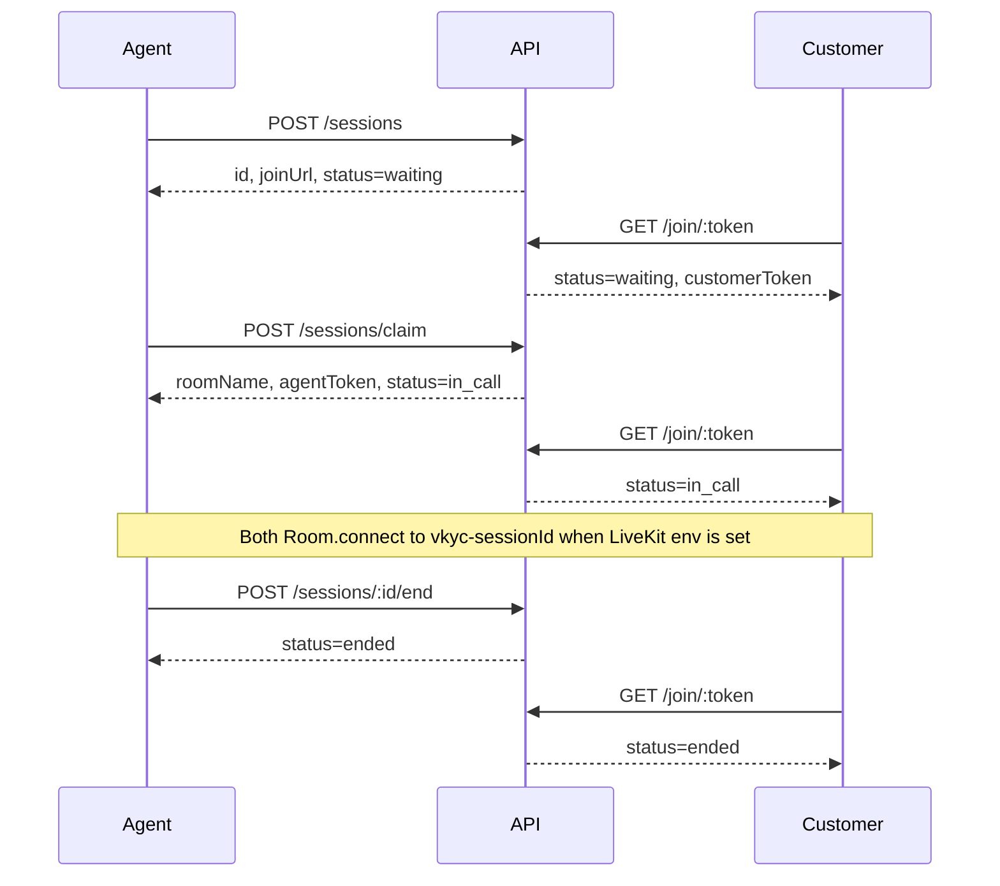

# Superbank Video KYC POC

Video KYC proof of concept. A new session enters the agent waiting queue. The customer opens a join link and waits. The agent claims one session, both sides enter the existing call, and the agent ends the session and sets a disposition. Any other waiting session stays in the queue. Wave 1 adds a stub customer payload, a checklist, still-frame captures, after-call notes, and a disposition (Approve, Reject, or UTV) on that same session. Wave 3 lets LiveKit egress attach a recording URL, shows that link in after-call work, and sends a CRM and datalake stub when a disposition is saved.

When LiveKit is configured, both browsers join room `vkyc-<sessionId>` and publish camera and microphone. When it is not, accept and join still succeed with non-connecting `lk-stub-…` tokens and the call shell stays up. OCR, liveness models, IDV, AML, SSO, and production hardening are out of scope. The checklist is a manual checkbox, not a model.

## Two-browser local run

Requires Node.js 20+ and pnpm 10.

```bash
git clone https://github.com/romin991/video-kyc-poc.git
cd video-kyc-poc
corepack enable
corepack prepare pnpm@10.33.3 --activate
pnpm install
pnpm dev
```

`pnpm dev` starts all three processes:

| Process | URL |
| --- | --- |
| API | http://127.0.0.1:3001 |
| Agent dashboard | http://127.0.0.1:5173 |
| Customer webview | http://127.0.0.1:5174 |

1. **Browser A (agent).** Open http://127.0.0.1:5173. The demo name in the header is a display label, not a login.
2. Click **Create session**. Copy the customer join link. It looks like `http://localhost:5174/join/<token>`.
3. **Browser B (customer).** Paste that link. The page should say **Waiting for an agent**. Leave it open.
4. **Browser A.** The session appears in the waiting queue. Click **Claim**, or **Claim next** for the oldest waiting session. Creating another session while this one is still waiting leaves both in the queue. Claiming one does not remove the other.
5. Both windows show the in-call shell: a remote tile and a local tile. With LiveKit env set, allow the camera and microphone. With it unset, the tiles stay on the placeholder and no permission prompt is expected.
6. **Browser A.** The in-call desk shows the stub customer (name, phone, product, application id, reason for VKYC), a checklist, stills, and ACW notes. Toggle a checklist item. It stays checked after refresh.
7. Set **Kind** to **ID**. Within about 1.5s, Browser B shows the customer camera full-frame with a card outline and the line “align ID inside the box”. **Face** or **Other** removes it. **Capture still** grabs one JPEG from the remote customer LiveKit camera when that track is live, and uses the customer tile when the track is not available. It uploads with the kind selected on the desk, including `id`. **Add still** uploads a JPEG or PNG file, which is enough when cameras are off. The thumbnail stays on the desk and in after-call work after refresh.
8. **Browser A.** Click **End session**.
9. Browser A leaves the call stage and opens after-call work for that session. The same stills and notes are there. **Call recording** shows a play or download link when a recording URL has been attached, or “No recording attached yet” until then. Approve, Reject, and UTV stay disabled until at least one still exists. Pick one. That writes a CRM and datalake stub (webhook or log line). Refresh the desk: **Open ACW** on the ended row shows the same disposition, notes, stills, and recording link.
10. Browser B changes to **Session ended** on its next check (about 1.5s) and stops polling.

Run the processes in separate terminals if you want quieter logs:

```bash
pnpm dev:api
pnpm dev:agent
pnpm dev:customer
```

The API keeps sessions, checklist, notes, disposition, and stills in memory. Restarting it drops them and invalidates open join links.

## LiveKit

Create a free project at [LiveKit Cloud](https://cloud.livekit.io). The free tier is enough for this proof of concept. After the project exists:

1. Copy the project WebSocket URL from the project page. It looks like `wss://your-project.livekit.cloud`.
2. Open **Settings → Keys** and copy the API key and API secret. See [where to find the key and secret](https://community.livekit.io/t/where-to-find-the-livekit-api-key-and-secret/92).
3. Put them in a repo-root `.env`. That file is gitignored. `.env.example` lists the names.

```bash
LIVEKIT_URL=wss://your-project.livekit.cloud
LIVEKIT_API_KEY=your_api_key
LIVEKIT_API_SECRET=your_api_secret
VITE_LIVEKIT_URL=wss://your-project.livekit.cloud
```

`VITE_LIVEKIT_URL` is the same WebSocket URL as `LIVEKIT_URL`. Restart `pnpm dev` after changing `.env`. Vite reads `VITE_*` at startup. The API loads the repo-root `.env` when it starts and does not override variables already set in the environment.

The API mints a LiveKit JWT with `livekit-server-sdk`:

| Claim | Value |
| --- | --- |
| identity | `agent` or `customer` |
| `roomJoin` | true |
| `room` | `vkyc-<sessionId>` |
| `canPublish` | true |
| `canSubscribe` | true |
| TTL | 10 minutes |

The same token is reused for a role and room until it is close to expiry, so the customer's join poll does not reconnect the call. Use headphones if both browsers are on one machine. The local tile stays muted.

If `LIVEKIT_API_KEY` or `LIVEKIT_API_SECRET` is missing, accept and join return `lk-stub-…` and do not throw. If `VITE_LIVEKIT_URL` is missing, the browser skips `Room.connect`. Either way the session shell still creates, accepts, joins, and ends.

## Signaling

| Method | Path | Result |
| --- | --- | --- |
| `POST` | `/sessions` | session, including stub `onboardingPayload` unless the body overrides it |
| `GET` | `/sessions?status=waiting` | waiting queue, oldest first |
| `GET` | `/sessions/:id` | one session, including checklist, notes, disposition, `captures[]`, and recording fields |
| `PATCH` | `/sessions/:id` | update `checklist`, `acwNotes`, `disposition`, and `captureGuide` |
| `POST` | `/sessions/:id/recording` | attach `recordingUrl` and/or `recordingId` (LiveKit egress) |
| `POST` | `/sessions/:id/captures` | store one JPEG or PNG still |
| `GET` | `/sessions/:id/captures/:captureId` | still bytes (`image/jpeg` or `image/png`) |
| `POST` | `/sessions/claim` | oldest waiting session → in call |
| `POST` | `/sessions/:id/accept` | that waiting session → in call |
| `GET` | `/join/:token` | `{ sessionId, roomName, customerToken, status, captureGuide, queuePosition }` |
| `POST` | `/sessions/:id/end` | `{ status: "ended", sessionId }` |
| `GET` | `/sessions/:id/call-recording` | `{ mode, recordingId }` while egress is starting, recording, or blocked |
| `POST` | `/sessions/:id/call-recording` | fallback `video` file (`video/webm` or `video/mp4`, 40 MB) when Cloud egress cannot start |
| `GET` | `/sessions/:id/call-recording/file.webm` or `file.mp4` | that fallback file |
| `GET` | `/health` | `{ ok: true, service: "vkyc-api" }` |

`agentToken` and `customerToken` are LiveKit JWTs when the API key and secret are set, and `lk-stub-…` strings otherwise. A second accept of the same session returns `409`. `POST /sessions/claim` on an empty queue returns `409`. Ending is idempotent. `X-Demo-Agent` is stored as `createdBy` on create and as `claimedBy` on claim or accept. It is not checked.

`POST /sessions` always returns `status: "waiting"`. It does not start the call. `queuePosition` is the 1-based place among waiting sessions and is `null` once the session is in call or ended. `GET /sessions?status=waiting` is oldest-first. Claim and accept each move exactly one waiting session to `in_call`.

```bash
curl -s -X POST http://127.0.0.1:3001/sessions \
  -H 'content-type: application/json' \
  -H 'x-demo-agent: Desk 1' \
  -d '{}'
```



## Call tiles

Each call shell renders:

- `<video data-livekit="remote">` for the other participant
- `<video data-livekit="local" muted>` for this participant

Those elements stay hidden until `data-active="true"` is set after a video track attaches. The hooks that do this match on purpose:

- `apps/agent-dashboard/src/livekit.ts`
- `apps/customer-webview/src/livekit.ts`

## Layout

```
apps/api                 Express session store, REST, LiveKit token mint, call egress
apps/agent-dashboard     Vite + React desk (waiting queue, claim, checklist, stills, ACW, end)
apps/customer-webview    Vite + React join page (waiting, in-call, ended)
```

## Scripts

```bash
pnpm test       # API lifecycle tests, plus JWT mint tests (no live LiveKit server)
pnpm typecheck  # tsc for all apps
pnpm build      # production bundles for both UIs
```

Optional environment variables are listed in `.env.example`. Defaults match the table above. The API listens on `127.0.0.1` only.

## Wave 1 desk

`POST /sessions` with `{}` stores this stub:

| Field | Stub |
| --- | --- |
| `fullName` | Ayu Prameswari |
| `phone` | +628123456789 |
| `productId` | SAVINGS-PLUS |
| `applicationId` | APP-2026-00421 |
| `reason` | New savings account video KYC |

Send overrides at the top level or under `onboarding`. A nested `onboarding` object wins for keys it sets. `product` is an alias of `productId`, `application` of `applicationId`, and `reasonForVkyc` of `reason`. Blank strings keep the stub. The customer page does not collect this.

The checklist starts as three unchecked items: `identity_match`, `liveness_digits`, `docs_shown`. `PATCH` updates `checked` by id. Notes are `acwNotes` (4000 characters). Disposition is `approve`, `reject`, or `utv` (labels Approve, Reject, and UTV are accepted). It is saved only after the session has ended and at least one still exists. Before that, the API returns `409` (call still open) or `422` with `error: "capture_required"`.

### Capture upload

**Capture still** uses `captureVideoStill` in `apps/agent-dashboard/src/captureStill.ts`. Pass a `MediaStreamTrack` or a LiveKit track (`mediaStreamTrack`). It draws one JPEG or PNG and does not stop the track. The desk posts that blob with `uploadSessionCapture` / `useCaptureUpload` in `apps/agent-dashboard/src/captures.ts` (`Blob`, `File`, or base64/data URL). `blobFromVideoFrame` paints the customer `<video>` when the remote track is not available.

`POST /sessions/:id/captures`

Multipart (`Content-Type: multipart/form-data`):

| Field | Required | Notes |
| --- | --- | --- |
| `image` | yes | JPEG or PNG file, 4 MB max |
| `kind` | no | `face`, `id`, or `other`. Default `other` |
| `capturedAt` | no | ISO-8601. Default is the server time |

JSON:

```json
{
  "image": "data:image/jpeg;base64,/9j/...",
  "kind": "face",
  "capturedAt": "2026-09-30T07:00:00.000Z"
}
```

`image` may also be raw base64 without the data-URL prefix. Content type is sniffed from the bytes, not the filename. The upload `kind` is the still's label. It is separate from `captureGuide`, which only controls the customer overlay. `201` returns:

```json
{
  "id": "cap_…",
  "url": "http://127.0.0.1:3001/sessions/<sessionId>/captures/<captureId>",
  "path": "/sessions/<sessionId>/captures/<captureId>",
  "kind": "face",
  "contentType": "image/jpeg",
  "createdAt": "2026-09-30T07:00:01.000Z",
  "capturedAt": "2026-09-30T07:00:00.000Z"
}
```

`GET /sessions/:id` includes `captures` as that same summary, without the bytes. `GET` the `path` (joined to the API origin) or `url` for the image. A session holds up to 20 stills. Unknown sessions return `404`. Non-images return `400`.

```bash
curl -s -X POST "http://127.0.0.1:3001/sessions/$ID/captures" \
  -F "kind=face" \
  -F "image=@still.jpg;type=image/jpeg"
```

### ID capture guide

`captureGuide` on the session is the kind the desk is capturing: `face`, `id`, `other`, or `null`. A new session starts at `null`. The customer does not send it.

The desk **Kind** menu sends `PATCH /sessions/:id` with `{ "captureGuide": "id" }` (or `face` / `other`). `null` clears it. Unknown values return `400` and leave the previous value in place.

`GET /sessions/:id` and the customer poll `GET /join/:token` both return `captureGuide`. While the call is open and the value is `id`, the customer webview fills the stage with their camera, draws a card-aspect wireframe (ISO ID-1, about 85.6 × 54), and shows “align ID inside the box”. The agent tile stays as a small preview. Any other value hides the overlay and restores the usual layout. The next join poll (about 1.5s) picks the change up.

**Capture still** and **Add still** are unchanged. They upload with the kind selected in that menu, including `id`, through `POST /sessions/:id/captures`. The guide does not crop, read, or score the image.

```bash
curl -s -X PATCH "http://127.0.0.1:3001/sessions/$ID" \
  -H 'content-type: application/json' \
  -d '{"captureGuide":"id"}'
```

## Waiting queue

A session is waiting from the moment it is created. The customer webview home can enter the queue itself (`POST /sessions`, then `/join/<token>`), and the desk **Create session** button does the same thing. Neither path opens the call. The join link is unchanged.

The desk polls `GET /sessions` about every 2 seconds and lists only `waiting` sessions, oldest first. **Claim next** calls `POST /sessions/claim`. **Claim** on a row calls `POST /sessions/:id/accept`. Both reuse the existing LiveKit join and the in-call desk (payload, checklist, Capture still, end, ACW, disposition). The desk claims one session at a time. While that call is open, further claim buttons stay disabled, and every other waiting session remains in the list. Ending the call sets `ended`. Disposition is still after-call work on that same session.

```bash
# Two customers waiting. Claim the oldest. The second stays queued.
curl -s -X POST http://127.0.0.1:3001/sessions \
  -H 'content-type: application/json' -d '{"fullName":"Ayu"}'
curl -s -X POST http://127.0.0.1:3001/sessions \
  -H 'content-type: application/json' -d '{"fullName":"Budi"}'
curl -s http://127.0.0.1:3001/sessions?status=waiting
curl -s -X POST http://127.0.0.1:3001/sessions/claim -H 'x-demo-agent: Desk 1'
curl -s http://127.0.0.1:3001/sessions?status=waiting
```

Claim and accept return `{ sessionId, roomName, agentToken, joinUrl, status: "in_call", claimedBy }`. There is no forecasting, shrinkage, skills routing, or assignment of one session to more than one agent.

## Call recording

When the call is in progress, this API starts LiveKit room-composite egress. When an egress id or file URL exists, it calls:

`POST /sessions/:id/recording`

```json
{
  "recordingUrl": "https://egress.example/vkyc/call.mp4",
  "recordingId": "EG_room_1"
}
```

| Field | Required | Notes |
| --- | --- | --- |
| `recordingUrl` | one of the two | Absolute `http:` or `https:` URL, 2048 characters max |
| `recordingId` | one of the two | Egress id, 200 characters max |

Send either field or both. A field you omit stays as it was. An empty string is `400`. `ftp:` and other non-http(s) URLs are `400`. Unknown sessions are `404`. The call can be waiting, in call, or ended. A later POST replaces only the fields it includes and refreshes `recordingAttachedAt`.

`200` is the session, including:

```json
{
  "recordingUrl": "https://egress.example/vkyc/call.mp4",
  "recordingId": "EG_room_1",
  "recordingAttachedAt": "2026-09-30T10:06:00.000Z"
}
```

`GET /sessions/:id` returns the same three fields. A new session has all three as `null`. Ending the call does not clear them.

After-call work reads `recordingUrl`. When it is set, the desk shows **Play or download recording** (new tab) and the URL. A URL whose path ends in `.mp4`, `.webm`, `.mov`, `.m4v`, or `.ogv` also renders a `<video controls>` player. `.mp3`, `.wav`, `.ogg`, and `.m4a` render an audio player. An id with no URL shows the id and no player. There is no retention screen and no SSO.

```bash
curl -s -X POST "http://127.0.0.1:3001/sessions/$ID/recording" \
  -H 'content-type: application/json' \
  -d '{"recordingUrl":"https://egress.example/vkyc/call.mp4","recordingId":"EG_room_1"}'
```

## Disposition stubs

Saving Approve, Reject, or UTV (`PATCH` with a non-null `disposition`, after the session has ended and a still exists) delivers one stub payload to CRM and one to the datalake. Notes-only patches and clearing disposition to `null` do not. A failed or missing webhook does not roll back the disposition. The desk still gets `200` with the session.

For each sink, the API POSTs JSON to that sink's webhook. If that webhook URL is unset, it appends one JSON line to the log file instead. A webhook that is set but returns a non-2xx, or cannot be reached, is written to the same log with `webhookError` set. Timeout is 8 seconds.

| Env | Default |
| --- | --- |
| `CRM_STUB_WEBHOOK_URL` | unset → log |
| `DATALAKE_STUB_WEBHOOK_URL` | unset → log |
| `DISPOSITION_STUB_LOG_PATH` | `data/disposition-stubs.jsonl` |

Relative log paths resolve from the repo root, not the API process cwd. `data/` is gitignored.

```json
{
  "sink": "crm",
  "sessionId": "<session id>",
  "disposition": "approve",
  "agentId": "Closer",
  "claimedBy": "Desk 1",
  "timestamps": {
    "createdAt": "2026-09-30T10:00:00.000Z",
    "acceptedAt": "2026-09-30T10:01:00.000Z",
    "endedAt": "2026-09-30T10:05:00.000Z",
    "dispositionAt": "2026-09-30T10:06:00.000Z"
  },
  "captures": [
    {
      "id": "cap_…",
      "kind": "face",
      "url": "http://127.0.0.1:3001/sessions/<session id>/captures/cap_…",
      "contentType": "image/jpeg",
      "createdAt": "2026-09-30T10:04:00.000Z",
      "capturedAt": "2026-09-30T10:04:00.000Z"
    }
  ],
  "recording": { "id": "EG_room_1", "url": "https://egress.example/vkyc/call.mp4" }
}
```

`agentId` is the `X-Demo-Agent` header on the disposition request (`Demo agent` when the header is blank). `claimedBy` is the agent who claimed or accepted the session, or `null`. `sink` is `crm` or `datalake`. The datalake body is the same shape. This is not a Corex or Onboarding client.

### QA

Recording link, without LiveKit egress:

```bash
ID=$(curl -s -X POST http://127.0.0.1:3001/sessions -H 'content-type: application/json' -d '{}' | jq -r .id)
curl -s -X POST "http://127.0.0.1:3001/sessions/$ID/captures" \
  -H 'content-type: application/json' \
  -d '{"image":"/9j/2Q==","kind":"face"}' >/dev/null
curl -s -X POST "http://127.0.0.1:3001/sessions/$ID/end" >/dev/null
curl -s -X POST "http://127.0.0.1:3001/sessions/$ID/recording" \
  -H 'content-type: application/json' \
  -d '{"recordingUrl":"https://egress.example/vkyc/call.mp4","recordingId":"EG_room_1"}'
```

Open the desk, **Open ACW** on that ended session. **Call recording** shows **Play or download recording** and an in-page video player, because the URL ends in `.mp4`.

Disposition stub, webhooks unset:

```bash
curl -s -X PATCH "http://127.0.0.1:3001/sessions/$ID" \
  -H 'content-type: application/json' \
  -H 'x-demo-agent: Closer' \
  -d '{"disposition":"approve"}'
tail -n 2 data/disposition-stubs.jsonl
```

Two lines, `sink` `crm` and `datalake`, with that session id, `disposition` `approve`, `agentId` `Closer`, capture metadata, and timestamps.

Disposition stub, webhooks set: point `CRM_STUB_WEBHOOK_URL` and `DATALAKE_STUB_WEBHOOK_URL` at listeners that return 2xx, restart the API, and repeat the PATCH. Each listener receives one JSON body. The log stays empty for that disposition unless a webhook fails.

## Out of scope

OCR, liveness models, IDV, AML, JumpCloud SSO, Corex, Onboarding, and production hardening. Forecasting, shrinkage, and skills-based routing are out of scope. Escalate and PSU are not dispositions. Recording is an attached URL and id only. CRM and the datalake are webhook or log stubs.

When LiveKit URL, API key, and API secret are all set, claim and accept arm a room-composite egress for `vkyc-<sessionId>`. The API waits until that room exists (a participant has connected), starts one MP4 egress, and stops it when the session ends. Track composite is not used: it needs track ids, and the room name is enough for one mixed file of the call.

The recorder then calls eng's attach route from [PR #7](https://github.com/romin991/video-kyc-poc/pull/7). **That route is not on `main` yet**, so this API does not store the fields and ACW here does not render the link. Until that PR lands, the POST returns `404` and the body is logged.

```
POST /sessions/:id/recording
{ "recordingUrl": "https://…", "recordingId": "<egress-id>" }
```

Send either field or both. An omitted field is left unchanged. The egress id is posted as soon as LiveKit returns it. When the finished egress has an HTTPS `file.location` (or `EGRESS_PUBLIC_BASE_URL` plus the object key), a second POST sends the id and that URL. A `404` is retried a few times. Accept, the call, and end still succeed.

Runnable check, once LiveKit env is set:

```bash
pnpm dev
```

1. Agent: **Create session**. Customer: open the join link and allow camera and microphone.
2. Agent: **Claim**. Both sides connect. The desk should say **Call recording is on** within a couple of seconds of the room being live. The API log shows `egress <id> recording vkyc-<sessionId>`.
3. Talk for a few seconds. Agent: **End session**.
4. The API log shows a stored `POST /sessions/<id>/recording`, or `was not stored (HTTP 404)` with `recordingId` and, when the file is ready, `recordingUrl`. After PR #7 is on the API, `GET /sessions/:id` includes those fields and ACW shows the link.

Egress file output:

| Env | Role |
| --- | --- |
| `EGRESS_S3_BUCKET` | Bucket on the StartEgress request. Blank uses storage configured on the LiveKit Cloud project. |
| `EGRESS_S3_REGION` | Bucket region when `EGRESS_S3_ENDPOINT` is empty. |
| `EGRESS_S3_ACCESS_KEY` / `EGRESS_S3_SECRET` | Optional when the Cloud project already has storage credentials. |
| `EGRESS_S3_ENDPOINT` | S3-compatible endpoint, `https://…`. Set `EGRESS_S3_FORCE_PATH_STYLE=true` for non-AWS. |
| `EGRESS_FILEPATH` | Default `recordings/{room_name}-{time}.mp4`. |
| `EGRESS_PUBLIC_BASE_URL` | HTTPS origin used when egress reports `s3://bucket/key` instead of an HTTPS location. |

If Cloud egress cannot start (no storage, egress disabled, the room API cannot be reached, or repeated start failures), the desk says it is recording in the browser, captures the customer tile and both microphones, and uploads that file on **End session**. The bytes stay in API memory at `GET /sessions/:id/call-recording/file.webm` (or `file.mp4`). The same POST is attempted with `recordingId` `local_…` and that URL, which ends in `.webm` or `.mp4` so ACW can play it. Restarting the API drops the file.

Without the three LiveKit variables, recording stays off and the call shell is unchanged.

## Out of scope

OCR, liveness models, IDV, AML, SSO, CRM, long-term recording retention, and production hardening. Forecasting, shrinkage, and skills-based routing are out of scope. Escalate and PSU are not dispositions. The ACW recording link is eng's, via the POST contract above.
